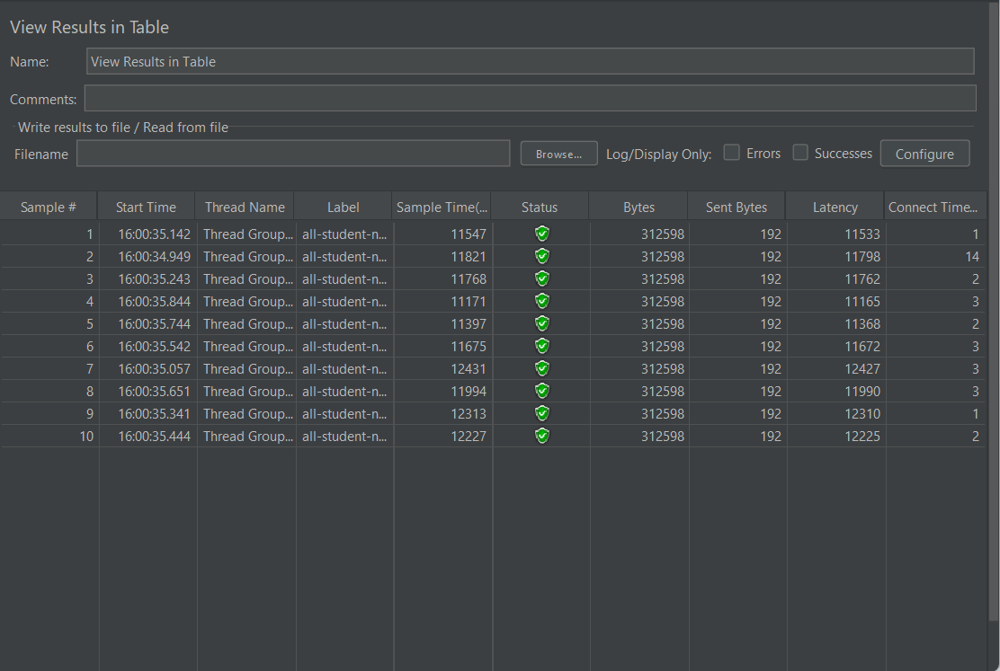
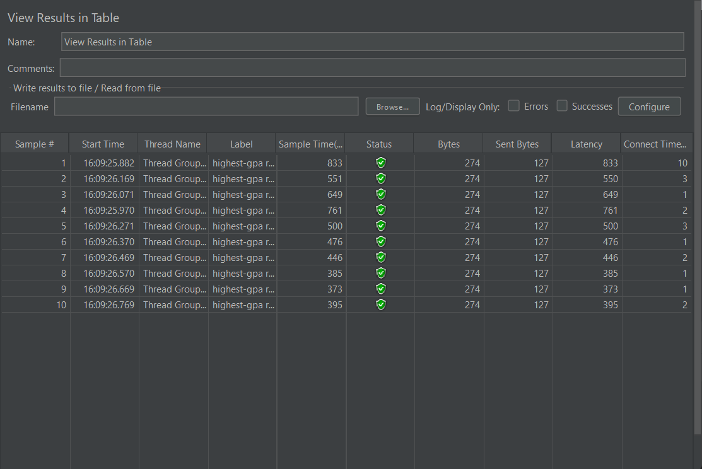
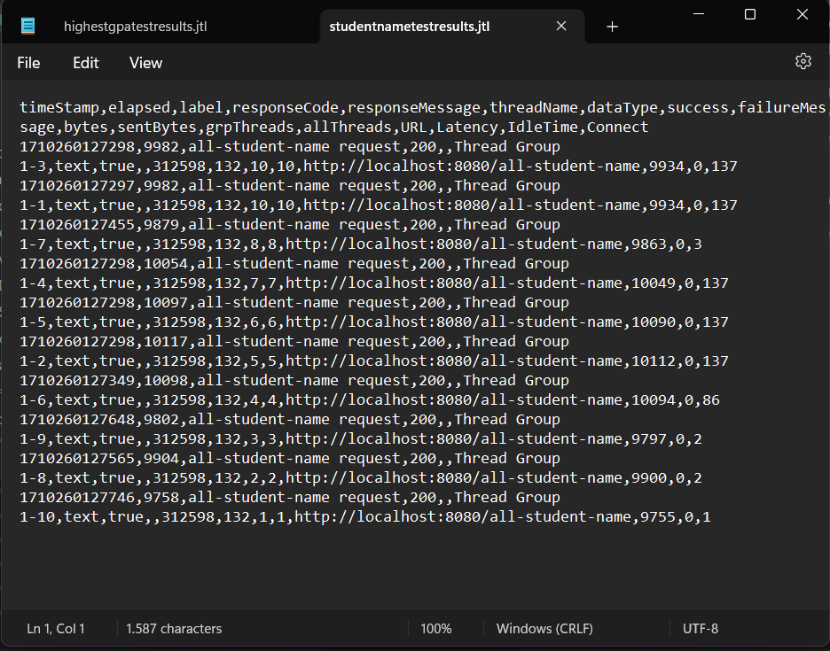
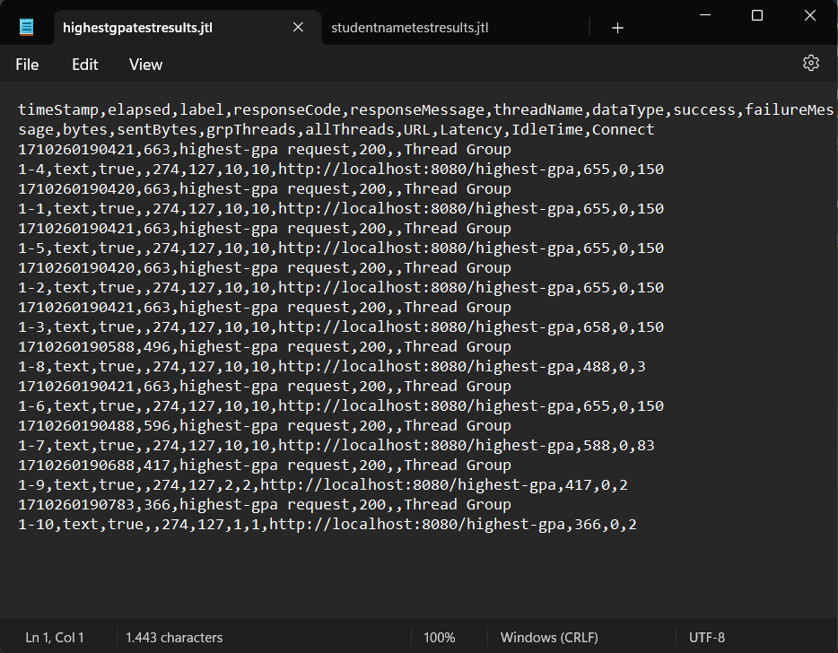
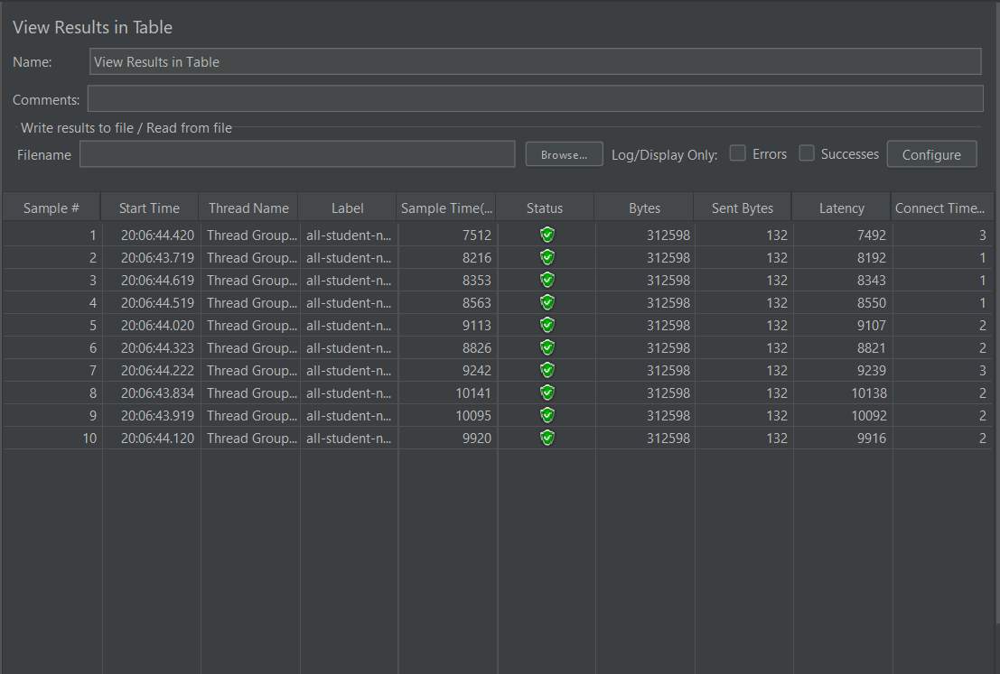
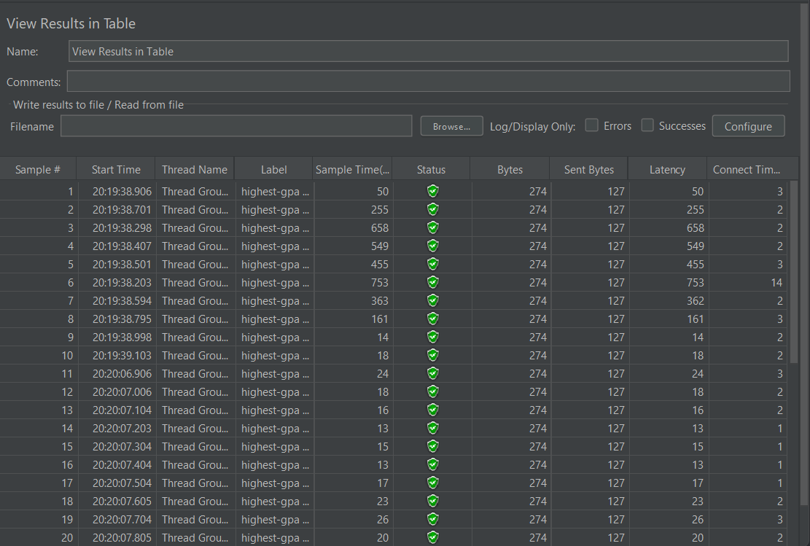

# Module 5 Advanced Programming

Name: Steven Faustin Orginata  
Class: Advprog B 
NPM: 2206030855 

    
Test Results

    /all-student-name test results  
      
    /highest-gpa test results  
    

    
Test Results (JTL)

    /all-student-name test results  
      
    /highest-gpa test results  
    

    
Test Results Optimized

    /all-student-name test results  
      
    /highest-gpa test results  
    

    
Reflection

    1. What is the difference between the approach of performance testing with JMeter and profiling with IntelliJ Profiler in the context of optimizing application performance?  
        JMeter gives the total time in the execution of a certain endpoint. It also has many variations of listeners that we can use according to our needs. While Intellij gives a certain output and highlights the one we need to notice like, top method that consume the most time.  
    2. How does the profiling process help you in identifying and understanding the weak points in your application? 
    Profiling gives me insight of how long and dirty a code can be.  
    3. Do you think IntelliJ Profiler is effective in assisting you to analyze and identify bottlenecks in your application code? 
    Yes, because through profiler, i could see which method is taking too long and needs optimization.  
    4. What are the main challenges you face when conducting performance testing and profiling, and how do you overcome these challenges? 
    Seeing which method should i optimize if the time isn't that long. For ex. the highest GPA.  
    5. What are the main benefits you gain from using IntelliJ Profiler for profiling your application code? 
    Intellij highlight the methods that took majority of the execution time. This gives me insight on which method i should optimize. 
    6. How do you handle situations where the results from profiling with IntelliJ Profiler are not entirely consistent with findings from performance testing using JMeter? 
    I repeat the testing until it is consistent with its findings. But, if it still doesn't work, i would check on the method myself and figure out why those findings aren't consistent.  
    7. What strategies do you implement in optimizing application code after analyzing results from performance testing and profiling? How do you ensure the changes you make do not affect the                     application's functionality? 
        I tried to use SOLID principles and my knowledge during Data Structures Algorithm class. I tried to reduce the number of loops and redundant methods. I am sure that the changes I made didn't affect the application by testing it before and after refactoring.

